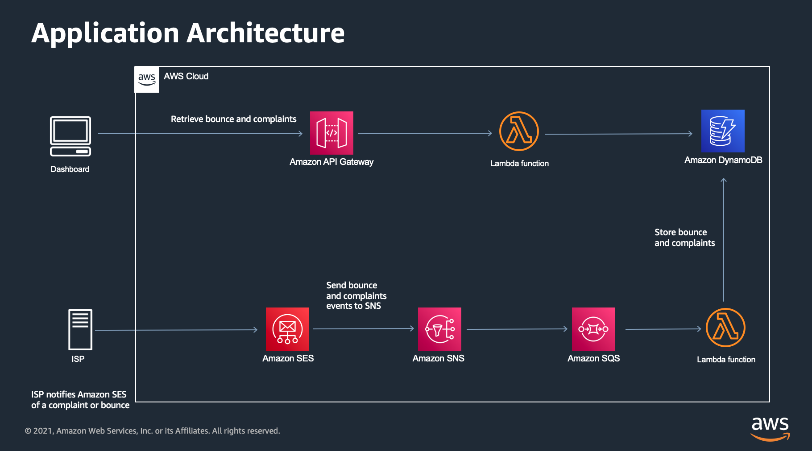

# Complaints and Bounce Reports from Amazon Simple Email Service (Amazon SES)

Bounce and complaint rates can have a negative impact on your sender reputation, and a bad sender reputation makes it
less likely that the emails you send will reach your recipients’ inboxes.
This sample shows how you can retrieve a list of bounce and complaints from Amazon SES and display them on a simple
dashboard.
You can remove the email addresses associated with the bounce and complaints from your recipient list. This measure will
help protect your deliverability and inbox placement rates.



Important: this application uses various AWS services and there are costs associated with these services after the Free
Tier usage - please see the [AWS Pricing page](https://aws.amazon.com/pricing/) for details. You are responsible for any
AWS costs incurred. No warranty is implied in this example.

```bash
.
├── README.MD              <-- This instructions file
├── dashboard              <-- Source code for the simple html dashboard
├── template.yaml          <-- AWS Service Application (AWS SAM) file containing source for the backend
```

## Requirements

* An AWS account. ([Create an AWS account](https://portal.aws.amazon.com/gp/aws/developer/registration/index.html) if
  you do not already have one and login.)
* AWS CLI already configured with Administrator permission
* [AWS SAM CLI installed](https://docs.aws.amazon.com/serverless-application-model/latest/developerguide/serverless-sam-cli-install.html) -
  **minimum version 0.48**.
* [NodeJS 18.x installed](https://nodejs.org/en/download/)

## Prerequisites

1. An existing Amazon SES Identity.
2. An Amazon Simple Notification Service (Amazon SNS) topic set up to receive bounce and complaints events
3. The Amazon Resource Name (ARN) of the SNS topic setup in 2 above. i.e. arn:aws:sns:us-east-1:123456789:
   ses-bounce-notification

## Backend installation instructions

1. Fork this repo

3. Clone the repo onto your local development machine:

```
git clone https://github.com/aws-samples/simple-ses-dashboard
```

4. Deploy the backend application:

```sh
sam build
sam deploy --guided --stack-name='ses-event-manager'
```

If you already have deployed stack

```sh
sam build
sam sync --stack-name='ses-event-manager'
```


4.1 PARA PROBAR LOCAL

```
    DOCKER_HOST=unix://$HOME/.docker/run/docker.sock sam local start-lambda
    DOCKER_HOST=unix://$HOME/.docker/run/docker.sock sam local start-api
```

```
sudo ln -sf "$HOME/.docker/run/docker.sock" /var/run/docker.sock
```

Accept the default arguments for the guided deployment with the following exceptions:

1. When prompted, specify the Amazon Resource Name (ARN)  for the Amazon SNS topic thats been setup to receive bounce
   and complaint events.
2. Select 'y' for the prompt 'GetEventsFunction may not have authorization defined, Is this okay?'

An example fo the guided deployment prompts is shown below

``` bash
❯ sam deploy --guided

Configuring SAM deploy
======================

        Looking for config file [samconfig.toml] :  Found
        Reading default arguments  :  Success

        Setting default arguments for 'sam deploy'
        =========================================
        Stack Name [ses-dashboard]: 
        AWS Region [us-east-1]: 
        Parameter BounceSNSTopic [arn:aws:sns:us-east-1:123456789:ses-bounce-notification]: 
        #Shows you resources changes to be deployed and require a 'Y' to initiate deploy
        Confirm changes before deploy [Y/n]: 
        #SAM needs permission to be able to create roles to connect to the resources in your template
        Allow SAM CLI IAM role creation [Y/n]: 
        #Preserves the state of previously provisioned resources when an operation fails
        Disable rollback [y/N]: 
        GetEventsFunction may not have authorization defined, Is this okay? [y/N]: y
        Save arguments to configuration file [Y/n]: 
        SAM configuration file [samconfig.toml]: 
        SAM configuration environment [default]: 
```

5. Once deployed, take note of the following outputs from the SAM build command

- EventsAPI: The API required to retrieve the list of bounce and complaints

## Frontend installation instructions

The dashboard code can be found in the `dashboard` subdirectory.

1. Add the following to the parameters.js file that can be found in the `dashboard` folder/

```javascript
const SES_URL = <The EventsAPI value from step 5 of
the
backend
installation >
```

2. Install the dependencies

```bash
npm install
```

4. Start the dashboard

```bash
npm run serve
```

Navigate to one of the listed URLs in your web browser

## Cleanup

1. Manually delete any objects in the application's S3 buckets.
2. Use the CloudFormation console to delete all the stacks deployed.

## Next steps

If you have any questions, please contact the author or raise an issue in the GitHub repo.

==============================================

Copyright 2023 Amazon.com, Inc. or its affiliates. All Rights Reserved.

SPDX-License-Identifier: MIT-0

